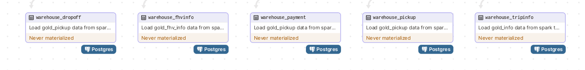

# NYC taxi tripRecord ETL-pipeline

## _New York City (NYC)_


## I. Introduce

### 1. Mục tiêu project

Với mục tiêu tìm hiểu và học tập về data engineering và big data, nhóm đã thực hiện project NYC taxi tripRecord. Project tập chung vào quá trình ETL từ database (Mysql) đến datawarehouse (Psql), đồng thời tận dụng sức mạnh của Minio, Pyspark và Polars để thực hiện clean và transform. Cuối cùng sử dụng streamlit để visualize và analyze data
Trong dự án này, nhóm mình sẽ minh họa rõ ràng và chi tiết các quy trình thực hiện `ETL` trên tập dữ liệu `TLC Trip Record Data` - một tập dữ liệu mở, phục vụ cho việc học tập và nghiên cứu.

### 2. Data Sources

`NYC-TripRecord` được chọn lọc từ tập dataset chính thức tại `TLC Trip Record Data`.
Dữ liệu bao gồm:

-   Yellow Taxi Trip Records: Đây là điều mọi người nghĩ đến khi nhắc về taxi ở New York. Chiếc taxi mang tính biểu tượng là tiêu chuẩn trong vận chuyển ô tô ở New York. Xe taxi màu vàng là phương tiện duy nhất được phép đón khách ở mọi nơi trong thành phố.
-   Green Taxi Trip Records: Xe xanh có thể thả bạn đi bất cứ đâu nhưng chỉ được phép đón khách ở những khu vực nhất định. 
-   For_Hire Vehicle Trip Records (FHV Trip Records): Là những taxi chủ yếu được sử dụng cho chuyến đi được sắp xếp trước. 
  
Dữ liệu được sử dụng trong project:

-   1 months (January / 2023)
-   Taxi Zone Shapefile - https://d37ci6vzurychx.cloudfront.net/misc/taxi_zones.zip

> **TLC Trip Record Data:**
>
> Link website: https://www.nyc.gov/site/tlc/about/tlc-trip-record-data.page
>
> Data Dictionary:
> https://www.nyc.gov/assets/tlc/downloads/pdf/data_dictionary_trip_records_yellow.pdf
> https://www.nyc.gov/assets/tlc/downloads/pdf/data_dictionary_trip_records_green.pdf
> https://www.nyc.gov/assets/tlc/downloads/pdf/data_dictionary_trip_records_fhv.pdf

## II. Architecture

### 1. Overview


Chi tiết:

-   `app`: thư mục cấu hình và xây dựng visualize trên `streamlit`
-   `dagster_home`: Dagit and dagster daemno's configuarations
-   `dataset`: Nơi lưu trữ các file dữ liệu với `.format : .parquet` để đưa lên `MySQL`
-   `dockerimages`: bao gồm những docker-images tự thiết lập, ví dụ dagster, spark master, streamlit,...
-   `load_dataset`: bao gồm các file có dạng `.sql` để tạo các schema và đưa dữ liệu vào `SQL, Postgres`
-   `minio`:
-   `mysql`:
-   `postgresql`:
-   `Test`: Kiểm thử các dòng code đơn lẻ để đảm bảo sự chính xác.
-   `.gitugnore + .gitattributes`: Code versioning
-   `docker-compose`: để compose docker contatiners
-   `env`: biến môi trường (mặc định các thông số) - có thể thay đổi theo người sử dụng.
-   `Makefile`: đơn giản việc thực thi trên terminal's commands
-   `README.md`: Reportings Overall For The Project
-   `requirements.txt`: các thư viện cần thiết.


### 2. Containerize the application with `Docker` and orchestrate assets with `Dagster`.

### 3. Bronze layer


Một vài xử lí nhỏ khi đọc file `taxizones.shp` để load các dữ liệu về kinh độ và vĩ độ

-   Sử dụng thư viện `GeoPandas` and `PyProj` và chuyển đổi từ `shapefile format` thành một `DataFrame`

        ```Python
        shapefile_path = f"{adr_data}/{zone_data}/{zone_data}.shp"

        gdf = gpd.read_file(shapefile_path)
        # Define
        source_crs = gdf.crs  # CRS of the shapefile
        target_crs = 'EPSG:4326'  # WGS84 - lat/lon CRS

        # Create a PyProj transformer
        transformer = pyproj.Transformer.from_crs(source_crs, target_crs, always_xy=True)

        gdf['longitude'] = gdf.geometry.centroid.x
        gdf['latitude'] = gdf.geometry.centroid.y
        gdf['longitude'], gdf['latitude'] = transformer.transform(gdf['longitude'], gdf['latitude'])

        df = pl.DataFrame(gdf[['LocationID', 'longitude', 'latitude']])
        ```

    Bao gồm các assets:

-   bronze_yellow_record: chứa data về yellow taxi NYC raw được lấy trực tiếp từ trang web
-   bronze_green_record: chứa data về green taxi NYC raw được lấy trực tiếp từ trang web
-   bronze_fhv_record: chứa data về fhv taxi NYC raw được lấy trực tiếp từ trang web
-   bronze_long_lat: chứa data về các kinh độ vĩ độ ở khu vực các taxi có thể đến

### 4. Silver layer


-   Sivler FHV.


-   Silver Yellow.


-   Silver Green.

Đây là bước xử lý data đã có được từ bronze layer.
Bao gồm các assets:

-   `Yellow`
    -   silver_yellow_pickup: PickUpID, Pickup_datetime, PULocationID
    -   silver_yellow_dropoff: DropOffID, Dropoff_datetime, DOLocationID
    -   silver_yellow_payment: PaymentID, Fare_amount, MTA_tax, Improvement_surcharge, Payment_type ,RateCodeID, Extra, Tip_amount, Tolls_amount, Total_amount, Congestion_Surcharge, Airport_fee
    -   silver_yellow_tripinfo: VendorID, PickUpID, DropOffID, PaymentID, Passenger_count, Trip_distance, Store_and_fwd_flag
-   `Green`
    -   silver_green_pickup: PickUpID, Pickup_datetime, PULocation
    -   silver_green_dropoff: DropOffID, Dropoff_datetime, DOLocation
    -   silver_green_payment: PaymentID, Fare_amount, MTA_tax, Improvement_surcharge, Payment_type, RateCodeID, Extra, Tip_amount, Tolls_amount, Total_amount
    -   silver_green_tripinfo: VendorID, PickUpID, DropOffID, PaymentID, Passenger_count,Trip_distance, Store_and_fwd_flag, Trip_type
-   `Fhv`
    -   silver_fhv_pickup: PickUpID, Pickup_datetime, PULocationID
    -   silver_fhv_dropoff: DropOffID, Dropoff_datetime, DOLocationID
    -   silver_fhvinfo: PickUpID, DropOffID, Dispatch_base_num, SR_Flag, Affiliated_base_number

### 5. Goal layer


Bao gồm các assets:

-   `gold_pickup` = silver_yellow_pickup + silver_green_pickup + silver_fhv_pickup + bronze_long_lat
-   `gold_dropoff` = silver_yellow_dropoff + silver_green_dropoff + silver_fhv_dropoff + bronze_long_lat
-   `gold_payment` = silver_yellow_payment + silver_green_payment
-   `gold_tripinfo` = silver_yellow_tripinfo + silver_green_tripinfo

### 6. Warehouse layer



    - warehouse_pickup = gold_pickup
    - warehouse_dropoff = gold_dropoff
    - warehouse_payment = gold_payment
    - warehouse_tripinfo = gold_tripinfo
    - warehouse_fhvinfo = silver_fhvinfo

-   Dữ liệu từ `gold_layer` và `silver_fhvinfo` sẽ được tải lên `Postgres` để lưu trữ và xử lí truong tương lai.

### 7. Visualize the data

-   Sử dụng `Streamlit Library` để visualize các dữ liệu
-   Dữ liệu được visualize được `connect` đến `Postgres` để lấy dữ liệu và chuyển đổi xử lí theo như mong muốn

## III. Data Lineage


## IV. Result - Visualize


